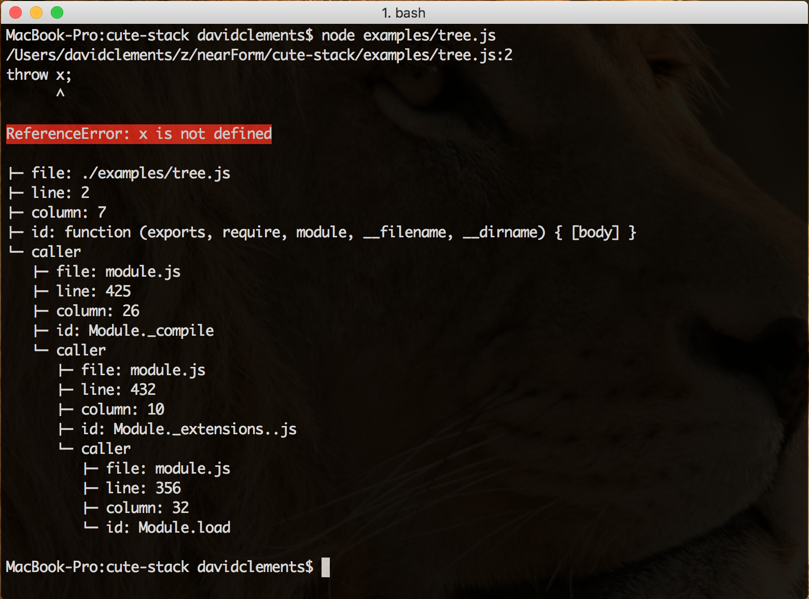

# Cute-stack

## Cute up your Node stack traces


```sh

npm install -g cute-stack # cli usage
npm install cute-stack --save # programmatic usage

```


## Usage

### CLI

New in version 1.3.x cute-stack has an executable, named `cute`.
Simply use `cute` instead of `node` to get cute-stack traces:

```sh
cute myApp.js
```

### Programmatic

Require, then call, `cute-stack` in your entry point file

```javascript
require('cute-stack')();
//...all your app code
```

## File Path Transforms

cute-stack converts paths in some cases.

Any frames that contain paths matching the 
current working directory, those parts of 
the paths matching the CWD will be replaced with `./`.
For instance, if the CWD is `/user/dave/projects/`,
and the file that's caused a trace is 
`/user/dave/projects/foo/bar.js`, the path will be
rewritten as `./foo/bar.js`.

The other, more esoteric transform concerns dependencies.
If a dependency causes a stack trace, it might
look something like `./node_modules/foo/node_modules/bar/node_modules/baz/index.js`. Quite lengthy. So `cute-stack` replaces node_modules
directories with a diamond character, so it becomes
`.♦foo♦bar♦baz/index.js`.

## API

### Type
```javascript
require('cute-stack')(type)
```

#### Supported types

* pretty  (default)
* table
* json
* json-pretty
* tree





### stackSize

```javascript
require('cute-stack')(stackSize)
require('cute-stack')(type, stackSize)
```

The `stackSize` parameter can be used to alter
how many frames a stack trace generates.

The default is 10, setting this to a high number
could have an impact on performance.

During development this could be set to `Infinity`
for unlimited stack traces

```javascript
require('cute-stack')('pretty', Infinity)
```

### uncute

```javascript
var cute = require('cute-stack')();
cute.uncute();
```
Removes alterations to stack traces


### noStack
```javascript
require('cute-stack').noStack();
```

Disables stack traces

## Plugins

```javascript
var cute = require('cute-stack');

function myPlugin(frame) {
  return 'result of processing a stack frame'
}
cute.ui.myPlugin = myPlugin;
cute('myPlugin')
```

Add a method to `cute.ui` to create a new plugin.
The method will be given each frame, and should 
return something based on that frame.

### init and print
```javascript
var cute = require('cute-stack');

function myPlugin(frame) {
  return 'result of processing a stack frame'
}
myPlugin.init = function () { 
  //do some initialisation
}
myPlugin.print = function (stack) {
  return '\n=====\n' + stack.join('\n') + '\n=====\n'
}
cute.ui.myPlugin = myPlugin;

cute('myPlugin')
```

If a plugin has an `init` method attached to it, 
this will be called prior to processing all frames

If it has a `print` method attached this will be
used to display all frames once they have been 
processed. 

## Plugin function

Instead of defining the plugin and passing its name, you can pass the plugin function
directly.

```js
function myPlugin(frame) {
  return 'result of processing a stack frame'
}
myPlugin.init = function () { 
  //do some initialisation
}
myPlugin.print = function (stack) {
  return '\n=====\n' + stack.join('\n') + '\n=====\n'
}

require('cute-stack')(myPlugin);
```

See a plugin example [bad-line](https://github.com/bahmutov/bad-line) that prints
actual source line where the crash happens for each local file in the stack.

## Filtering stack frames

You can limit printed stack frames using `plugin.filter` method. Just return truthy value
for frames to be included in the stack. For example to skip printing `module.js` calls
when printing using default formatter

```js
var cute = require('cute-stack');
cute.ui.default.filter = function isNotModuleJs(frame) {
  return !/^module\.js$/.test(frame.file);
}
cute();
throw x;
```


## Kudos

### Collaborators

* Gleb Bahmutov (@bahmutov)

### Sponsorship

Sponsored by nearForm
